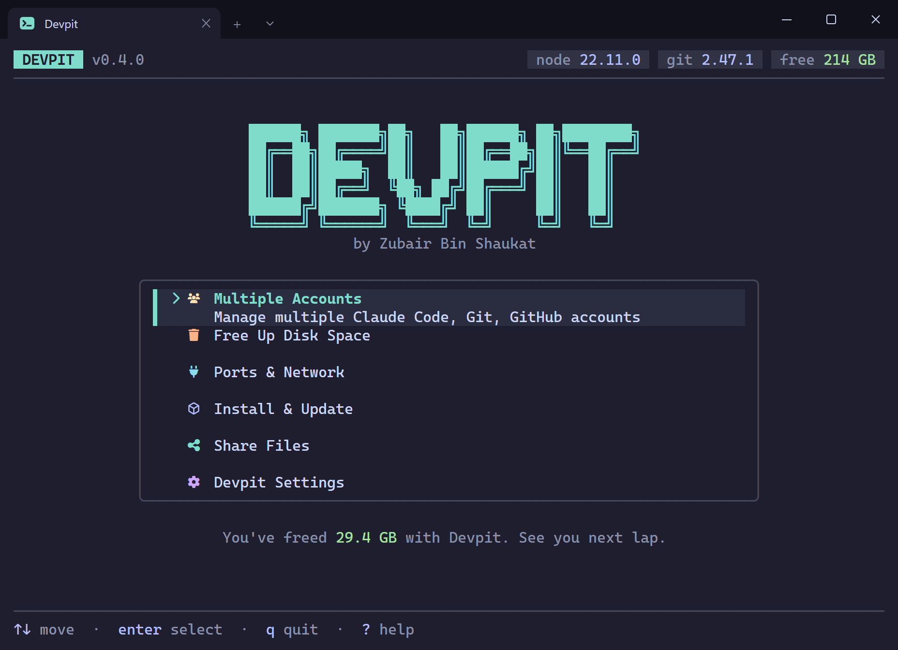

<p align="center">
  <a href="https://devpit.zubyr.dev"></a>
</p>

<h1 align="center">Devpit</h1>

<p align="center">
  <b>A pit stop for your dev machine.</b><br>
  A free, open-source toolkit for Windows developers: the right account in every folder, disk space back, stuck ports freed, tools updated and big folders moved between PCs. One menu.
</p>

<p align="center">
  <a href="https://github.com/zubairbinshaukat/devpit/actions/workflows/ci.yml"></a>
  <a href="https://github.com/zubairbinshaukat/devpit/releases/latest"></a>
  <a href="LICENSE"></a>
  
  
  
  
</p>

<p align="center">
  <a href="https://devpit.zubyr.dev">Website</a> ·
  <a href="#install">Install</a> ·
  <a href="#what-it-does">Features</a> ·
  <a href="#accounts">Accounts</a> ·
  <a href="#safety">Safety</a> ·
  <a href="docs/safety.md">Safety rules</a> ·
  <a href="PRIVACY.md">Privacy</a> ·
  <a href="#author">Author</a>
</p>

<p align="center">
  <a href="https://devpit.zubyr.dev/docs/getting-started"></a>
</p>

---

Devpit (or "Devpit CLI") is a free, open-source toolkit for developers on
Windows. One terminal menu keeps the right account in every folder for Claude
Code, Git, GitHub, Vercel and more, frees disk space from `node_modules`,
caches and Docker leftovers, frees busy ports, installs and updates your
developer tools, and copies big folders between two PCs on your network.

Windows first. Go, Bubble Tea, single executable, no runtime to install.

> **Beta.** Every section works end to end and the delete engine is covered by
> safety tests, but this is an early release. Nothing is removed or switched
> without a preview and a confirmation, Safe items are renamed before a byte is
> removed so an interrupted delete can be finished rather than half-done, and
> riskier items go to the Recycle Bin. Keep your backups anyway.

## Install

One line in PowerShell. It downloads the latest release from GitHub, verifies
the SHA256 checksum, adds Devpit to your user PATH and installs the icon font
for your user (see [Icons and themes](#icons-and-themes)). No admin needed.

```powershell
irm https://devpit.zubyr.dev/install | iex
```

Then type `devpit`. To skip the icon font, pass `-NoFont` through a script
block (`iex` cannot take flags):

```powershell
& ([scriptblock]::Create((irm https://devpit.zubyr.dev/install))) -NoFont
```

Other ways:

- Scoop:

  ```powershell
  scoop bucket add zubyr https://github.com/zubairbinshaukat/scoop-bucket
  scoop install devpit
  ```

- Download `devpit.exe` from the [latest release](https://github.com/zubairbinshaukat/devpit/releases/latest) (x64 and ARM64).
- Build from source with Go 1.26 or newer, no C toolchain needed:

  ```powershell
  git clone https://github.com/zubairbinshaukat/devpit
  cd devpit
  go build -o devpit.exe .
  .\devpit.exe
  ```

## What it does

The home menu has six entries, in this order. Press `1`–`6` to jump to one.

| Key | Section | What it does |
| --- | --- | --- |
| 1 | Accounts | Uses the right account in every folder for Claude Code, Git, GitHub, Vercel, Firebase, Supabase and Cloudflare (beta). Every row shows which account is active and why: everywhere, a folder rule, or a project file. Your Git name and email and your GitHub SSH key are set up here too. See [Accounts](#accounts) |
| 2 | Free Up Disk Space | One scan finds `node_modules`, build folders, package caches, Docker leftovers, old Scoop versions and Windows temp, labels each by risk, and deletes only what you tick |
| 3 | Ports & Network | **Fix stuck ports & apps** frees a busy port in two keystrokes and lists busy dev ports and stuck Node processes, with a kill-tree option for npm, pnpm, yarn and node. **Network tools** shows your local and public IP, pings and flushes DNS |
| 4 | Install & Update | **Install developer apps** from a catalog through Scoop, winget or Chocolatey. **Update everything** through every package manager it finds, in one pass. Press `s` twice to skip the app that is updating; apps that need admin rights are retried once at the end with one admin prompt |
| 5 | Share Files | Moves a big folder between two PCs on the same network with live progress, automatic retry and Resume. The sharing PC gets one admin prompt and a temporary read-only login that is removed when sharing stops. The receiving PC checks the exact size and free space first. No commands to type, and it works in any Windows language |
| 6 | Devpit Settings | Theme, icon tier, Nerd Font install, never-touch list, dev port list, privacy |

## Accounts

Work repo, side project, a client's Vercel team: tell Devpit once which account
a folder uses, and `claude`, `git`, `gh`, `vercel`, `firebase`, `supabase` and
`wrangler` use it in that folder by themselves.

```
 Accounts                                        in C:\Work\client-api

 Claude Code   work (you@work.com)               folder rule: C:\Work\client-api
 Git           You <you@work.com>                folder rule: C:\Work
 GitHub        work (you-at-work)                folder rule: C:\Work
 Vercel        default (you@gmail.com)           everywhere
 Cloudflare    default (you@gmail.com)           everywhere · beta
 Convex        project: client-api               set by this project's .env.local
 Firebase      not signed in
 Supabase      not installed
```

- **Pick a tool, pick an account, read the preview.** The preview says in plain
  words what will change, and the default answer is No. After the change, `v`
  verifies every tool (expected against what it reports) and `u` undoes it.
- **Two Claude Code accounts on one PC.** Each extra account gets its own
  Claude Code config folder (`CLAUDE_CONFIG_DIR`, the method Claude Code
  documents), set only for the `claude` process started in that folder. Skills
  can be shared from your main account and settings copied over; plugins are
  installed per account from the same list.
- **From the command line too.** `devpit claude` shows which account is used
  here and why, `devpit claude use work` switches after a preview,
  `devpit accounts verify` checks before you push or deploy, and `--json` gives
  stable output for scripts and AI agents. Without a terminal to ask in, a
  change needs `--yes`.

What it does **not** do:

- Store or show tokens. Each tool keeps its own login; Devpit's rules file
  holds only names, emails and folder paths.
- Touch your repos. Rules live in Devpit's own files, so nothing shows up in
  `git status`. `devpit accounts cleanup` removes everything Devpit added.
- Switch editor extensions or desktop apps. Rules apply in terminals, including
  the VS Code terminal, and to AI agents started there.
- Switch Convex. Convex picks the account per project, so Devpit shows it and
  verifies it but does not change it. Cloudflare support is beta: folder rules
  only, "everywhere" stays Wrangler's own login.

## Safety

These rules are not preferences. They are enforced in the code and every one
is pinned by a test. The full table is in [docs/safety.md](docs/safety.md).

- Nothing is deleted without a preview and an explicit confirmation.
- The default answer on every confirmation is No. The confirm dialog has no
  way to be built with a Yes default.
- Careful items need you to type `DELETE`.
- Projects you touched in the last 7 days are never pre-ticked.
- A folder is only junk when its marker file sits beside it (`package.json`
  for `node_modules`, `Cargo.toml` for `target`), and the marker is checked
  again right before deleting.
- Junctions, symlinks and other reparse points are treated as leaves and never
  followed. This is the bug that made other cleaners delete real source code.
- Drive roots, the Windows directory, network paths and your never-touch list
  are refused by both the scanner and the deleter.
- Safe items are renamed to a tombstone before removal, so an interrupted
  delete leaves a folder that a later run finishes, never a half-emptied one.
- Docker volumes are never touched.
- Every confirmation tells you how to get the thing back (`npm install`).

Accounts follows the same rules, plus its own:

- No token is ever stored, shown, copied, uploaded or logged. Each tool keeps
  its own login.
- Every account change has a plain-words preview, defaults to No and can be
  undone (`u`, or `devpit undo`).
- Login and account folders can never be selected in Free Up Disk Space.
- Login files are never copied when you share a Claude Code setup, and nothing
  in the other account is overwritten: same-named items are kept beside it or
  moved to a backup folder.
- No network traffic of its own: only each tool's own sign-in and who-am-I
  check.
- Without a terminal to ask in, a change needs `--yes`, so an AI agent cannot
  switch an account until you agree.

## Privacy

Nothing leaves your machine unless you turn usage stats on, and they are off
until you do. `DEVPIT_NO_TELEMETRY=1` and `DO_NOT_TRACK=1` always win. See
[PRIVACY.md](PRIVACY.md) for exactly what would be sent.

## Usage

```
devpit                 open the app
devpit version         print the version
devpit --ascii         force the plain ASCII icon tier
devpit font install    install the icon font (--quiet for one line)
devpit font remove     remove it and undo the Windows Terminal change
devpit font status     say whether it is installed

devpit claude                   which Claude Code account is used here, and why
devpit claude use work          use the work account here (asks first)
devpit accounts verify          check every tool before you push or deploy
devpit accounts verify --json   the same, as stable JSON for scripts and agents
devpit undo                     take back the last account change
```

The other subcommands (`clean`, `ports`, `update`, `settings`) are reserved
and tell you which milestone fills them in.

Inside the app the header carries a tab for every section. `Tab` and
`Shift+Tab` move along it, `1`–`6` jump straight to a section from the main
menu, and the mouse works too: click a tab or a menu row, scroll a list with
the wheel. Press `?` on any screen for its shortcuts. When a newer release is
out, the header shows an `update` pill and **Settings → About Devpit** tells
you the one command that upgrades your install.

### Icons and themes

Devpit has three icon tiers and picks one automatically. Windows Terminal ships
a font with no Nerd Font glyphs, and no program can ask a terminal what fonts it
has, so the rich tier is opt-in: the installer (or Settings › Icon font, or
`devpit font install`) installs the icon font for you, adding it to Windows
Terminal as a fallback so your own font is kept, and Devpit asks whether the
glyphs render before turning them on. Themes: auto, dark,
light, aqua, blue, rose and mono. See [docs/icons.md](docs/icons.md).

## Development

```powershell
task check        # build + vet + lint + test
task hooks        # run `task check` automatically before every push
go run .          # run from source
```

Go 1.26+, `golangci-lint`, `gofumpt` and `task` (all available through Scoop).
Engine packages never import Bubble Tea; screens bridge them with channels.
See [docs/architecture.md](docs/architecture.md) and
[CONTRIBUTING.md](CONTRIBUTING.md).

## Author

<a href="https://zubyr.dev"></a>

**Zubair bin Shaukat** (zubyr), software engineer from Lahore, Pakistan.
Devpit is the toolkit he wanted for his own Windows machine, so he built it and
gave it away.

[Portfolio](https://zubyr.dev) · [GitHub](https://github.com/zubairbinshaukat) · [LinkedIn](https://www.linkedin.com/in/zubairbinshaukat) · [X](https://x.com/zubyrdev)

<br clear="left">

## License

[MIT](LICENSE). Icon tables are vendored from lazygit (MIT), see [NOTICE](NOTICE).
